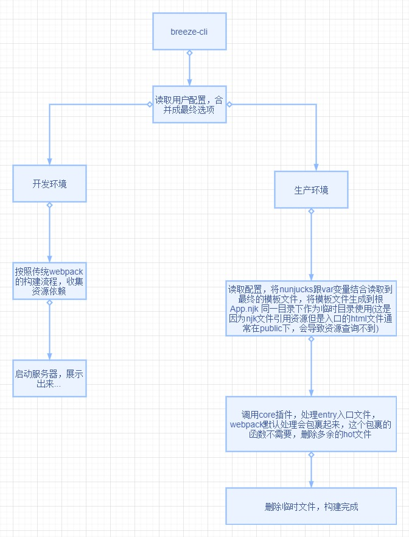

# 流程图

- 开发环境的构建，遵循 webpack 的配置，但是注意因为热重载是通过`websocket`来实现的，对于 IE9 之下的浏览器`object.defineproperty`也不支持，所以开发环境要调试选择高版本的浏览器，最终构建文件之后完成之后，在放置到 IE 特定的版本下调整

- 生产环境

生产环境下，因为要避免`webpack`对 js 资源文件的一些额外信息注入，所以这里将入口信息保存，通过插件来完成资源的添加以及调用`typescript`来完成代码的转换
